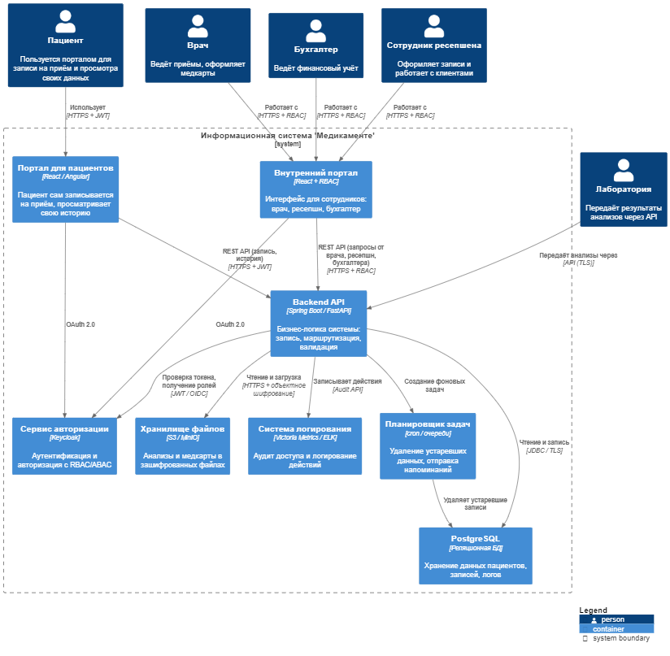

# 🧱 Архитектура To-Be (MVP) компании «Медикаменте» — Container Diagram (C4 Level 2)

## 🎯 Цель

Создать архитектуру MVP, которая:
- обеспечивает онлайн-запись пациентов через портал,
- автоматизирует работу сотрудников,
- учитывает требования по безопасности и защите персональных данных (PII/PHI),
- масштабируется для будущих интеграций и роста нагрузки.

---

## 📦 Компоненты архитектуры

### 👤 Внешние акторы

- **Пациент** — записывается через портал, просматривает свою историю.
- **Сотрудник ресепшена** — оформляет записи пациентов.
- **Врач** — ведёт медкарты, вносит заключения.
- **Бухгалтер** — формирует отчёты и просматривает данные об оплатах.
- **Лаборатория** — интеграция по API для передачи результатов анализов.

---

### 🧱 Контейнеры

| Контейнер           | Назначение |
|---------------------|------------|
| **webPortal**       | Веб-портал для пациентов: самостоятельная запись, личный кабинет. |
| **staffPortal**     | Внутренний интерфейс для сотрудников (ресепшн, врач, бухгалтер). |
| **authService**     | Сервис авторизации (Keycloak) с поддержкой RBAC/ABAC и OAuth2. |
| **apiGateway**      | Backend API с бизнес-логикой: управление записями, медданными, анализами. |
| **db (PostgreSQL)** | Хранение PII/PHI данных, истории записей, аудита. |
| **fileStorage**     | Защищённое хранилище медкарт и анализов (S3/MinIO с шифрованием). |
| **logs**            | Система логирования и аудита действий (Victoria Metrics / ELK). |
| **scheduler**       | Планировщик задач: удаление данных, напоминания и другие фоновые процессы. |

---

## 🔐 Потоки данных и безопасность

- Все порталы работают **только по HTTPS + JWT**.
- **Авторизация**: через `authService` по протоколу OAuth 2.0 / OpenID Connect.
- **Доступ к API** ограничен ролями (RBAC/ABAC).
- **Файлы** загружаются и хранятся в зашифрованном виде.
- **Аудит** ведётся централизованно, все действия записываются.
- **Удаление данных** автоматизировано, с возможностью soft-delete.

---

## 🔄 Взаимодействия (ключевые связи)

- `webPortal` и `staffPortal` запрашивают `authService` для авторизации.
- `webPortal` → `apiGateway`: создание и просмотр записей.
- `staffPortal` → `apiGateway`: работа с медкартами, оплатами, анализами.
- `apiGateway` → `db`, `fileStorage`, `logs`, `scheduler`.
- `scheduler` → `db`: удаление устаревших записей.
- `lab` → `apiGateway`: безопасная передача результатов анализов.

---

## ✅ Примечания

- Все взаимодействия защищены по принципу **Privacy by Design**.
- Используются принципы **Data Minimization**, **Data Lineage**, **Тегирование данных**, **RBAC/ABAC**.
- Архитектура полностью готова к масштабированию и интеграции мобильного приложения в следующем этапе развития.
